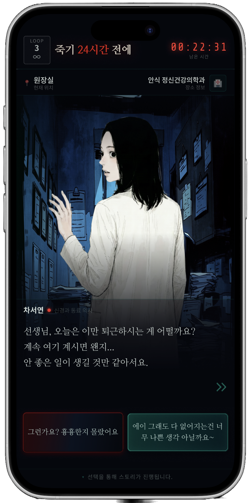
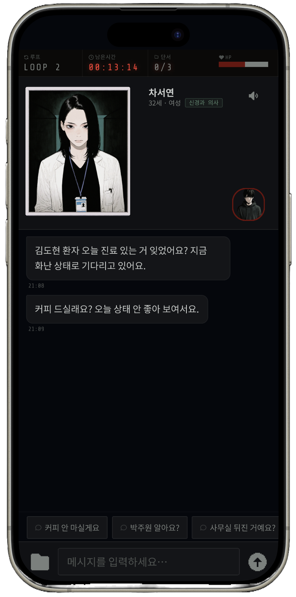

# 죽기 24시간 전에

> 당신은 오늘 밤 죽습니다.
> 24시간 전으로 돌아가 범인을 찾으세요.

**죽기 24시간 전에**는 LLM 캐릭터 챗봇과 대화하며 나를 죽인 범인을 추리하는 루프형 미스터리 스릴러 게임입니다.

👉 **[지금 플레이하기](https://hateslop4-dead24.onrender.com)**

> 📱 모바일 우선으로 개발되었습니다.

<p align="center">
  
  &nbsp;&nbsp;
  
</p>
<p align="center"><sub>하루 선택 화면 · NPC 채팅 화면</sub></p>

---

## 스토리

당신은 정신건강의학과 <안식>의 상담사입니다.
9월 3일 오전 7시, 당신은 죽었습니다. 아무도 당신의 마지막을 지켜보지 않았습니다.

눈을 뜨면 죽기 정확히 하루 전, **9월 2일 오전 7시**.
그리고 **밤 12시**, 누군가가 당신을 찾아옵니다.

이 루프를 운영하는 관리자 **치키**가 규칙을 안내합니다.
주어진 기회는 **단 세 번**. 자정이 오기 전에 당신을 노리는 사람을 찾아내야 합니다.

### 의심 인물

| 인물 | 관계 |
|---|---|
| **김도현** | <안식>의 내담자 |
| **차서연** | <안식>의 정신건강의학과 의사, 당신의 동료 |
| **박도원** | <안식>의 청소부 |
| **윤미경** | 당신의 어머니 |

모두 당신에게 무언가를 숨기고 있습니다. 그리고 루프를 거듭할수록, 당신이 잊고 있던 기억도 조금씩 드러납니다.

---

## 플레이 방식

1. **오프닝**: 이름과 성별을 입력하면 루프가 시작됩니다.
2. **하루 보내기**: 집에 있을지, 출근할지 등 하루의 선택지를 고릅니다. 선택에 따라 그날의 상황과 마주치는 인물이 달라집니다.
3. **대화하기**: 인물과 자유롭게 채팅합니다. 말 한마디에 인물의 태도가 바뀌고, 잘못된 말은 자정 전에도 죽음을 부를 수 있습니다.
4. **단서 모으기**: 대화 속 키워드로 단서를 얻고, 잠긴 금고의 비밀번호를 풀어냅니다.
5. **범인 지목**: 자정이 오기 전에 범인을 지목합니다. 틀리면 이 아침은 다시 시작됩니다.

---

## 주요 기능

- **캐릭터가 유지되는 NPC 챗봇**
  캐릭터별 Few-shot 프롬프트와 RAG로 성격, 말투, 세계관을 지키며 대답합니다. 루프 회차에 따라 공개되는 정보도 달라집니다.
- **감정 수치에 따라 바뀌는 태도**
  NPC마다 신뢰, 적대감, 의심, 죄책감 등의 수치가 있어서 대화에 따라 말투와 태도가 달라집니다.
- **대답에 맞는 표정 이미지**
  NPC의 대답과 표정 이미지 캡션의 임베딩 유사도를 비교해, 상황에 맞는 이미지를 함께 보여줍니다.
- **플레이어 맞춤 대사**
  입력한 이름과 성별이 인물들의 호칭과 대사에 반영됩니다.
- **3번의 루프와 엔딩**
  루프마다 새로운 정보가 열리고, 세 번의 기회를 모두 쓰면 엔딩으로 이어집니다.

---

## 기술 스택

| 구분 | 사용 기술 |
|---|---|
| Frontend | HTML, CSS, JavaScript (모바일 화면 기준 웹) |
| Backend | FastAPI |
| LLM | OpenAI GPT-6 Luna, LangGraph, LangChain |
| RAG | Chroma, OpenAI `text-embedding-3-small` |
| 이미지 | Cloudinary |
| 배포 | Docker, Render |

### 구조

```
frontend/   게임 화면 (오프닝 → 하루 선택 → 채팅 → 범인 지목 → 엔딩)
backend/    FastAPI 서버, 게임 세션과 API
llm/        LangGraph 기반 대화 로직
├── prompts/       캐릭터별 시스템 프롬프트
├── nodes/         대화·버튼·루프 처리 노드
└── vector_store/  세계관·캐릭터·단서 문서와 RAG 검색
```

---

## 문서

- [엔지니어 파트 발표 자료](documents/engineer-presentation.md): 전체 구조, 프롬프트 설계, RAG와 이미지 검색
- [개발 노트](documents/development-notes.md): 역할 분담, Phase별 개발 계획과 기록, 로컬 실행 방법
- [개발 TODO](documents/todo.md): 남은 작업

---

## 팀 죽24

| 이름 | GitHub | 역할 |
|---|---|---|
| 이서진 | [@Glenn-Bonsai](https://github.com/Glenn-Bonsai) | 엔지니어 |
| 최가영 | [@dokong22222](https://github.com/dokong22222) | 엔지니어 |
| 지민 | | 프로듀서 |
| 김민서 | | 프로듀서 |

프로듀서가 세계관·캐릭터·스토리를 기획하고, 두 엔지니어가 LLM 챗봇, RAG, 백엔드, 프론트엔드 개발을 함께 진행했습니다.
